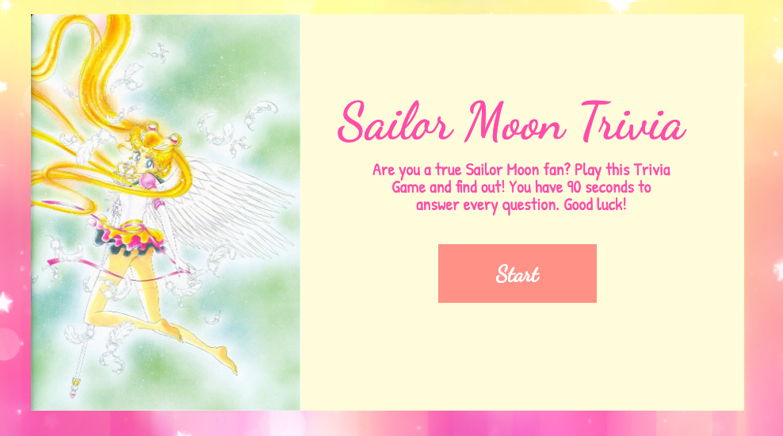
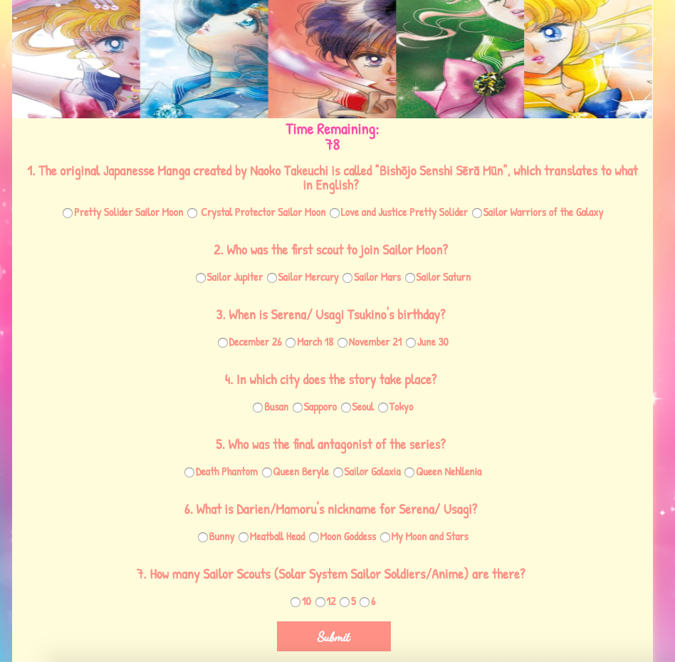
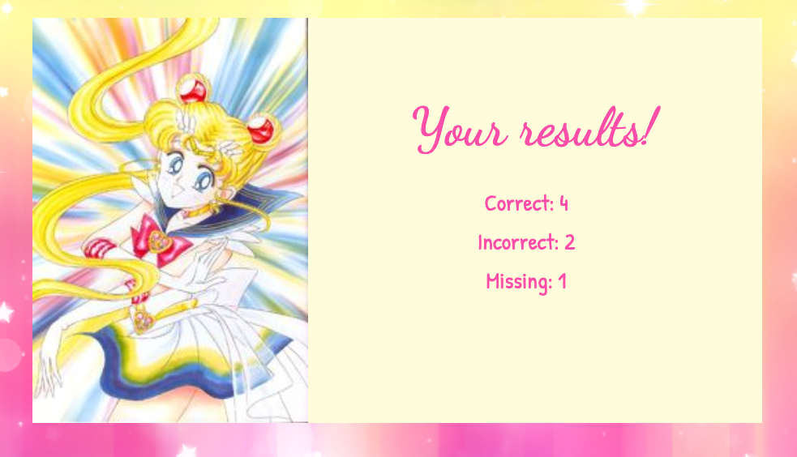

# Sailor Moon Triva Game
https://ersjava.github.io/TriviaGame/

An interactive web browser trivia game that uses JavaScript for the logic and jQuery that dynamically updates the HTML.

## How It Works

 
* The user has 90 seconds to answer 10 Sailor Moon trivia questions.

 
* The questions are multiple choice.

 
* The user's results are displayed at the end of the game.

## Project Details

### Technologies Used
* jQuery
* JavaScript
* CSS
* HTML5

## Contributing
Pull request are welcome!

